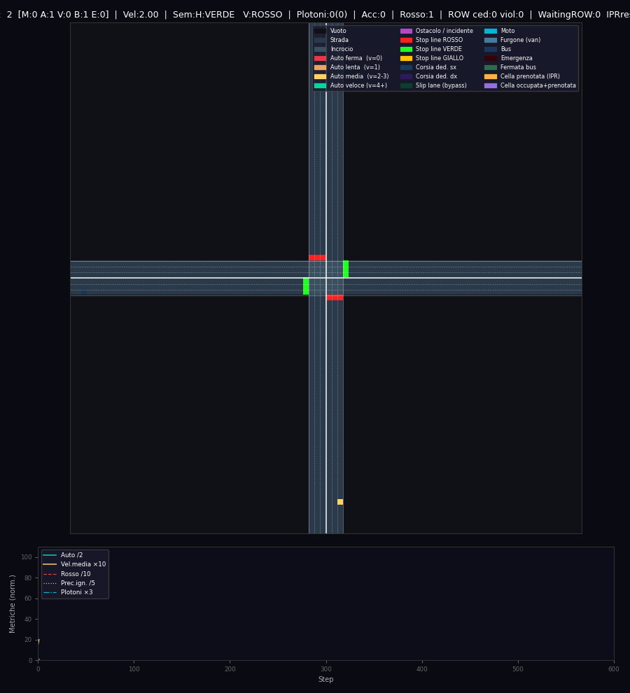

# Simulatore di Traffico Urbano — Incrocio a +

Simulatore 2D basato su automi cellulari con incrocio regolato da semaforo,
precedenze (ROW), percorsi con prenotazione (IPR), sorpassi e profili di guida.

---

## Indice

1. [Anteprima](#1-anteprima)
2. [Come avviare](#2-come-avviare)
3. [Modalita debug](#3-modalita-debug)
4. [Architettura](#4-architettura)
5. [Modello di guida](#5-modello-di-guida)
6. [Incrocio: IPR e precedenze](#6-incrocio-ipr-e-precedenze)
7. [Geometria e corsie](#7-geometria-e-corsie)
8. [Visualizzazione](#8-visualizzazione)
9. [Configurazione scenari](#9-configurazione-scenari)
10. [Limitazioni note](#10-limitazioni-note)

---

## 1. Anteprima



---

## 2. Come avviare

### Requisiti

```
Python >= 3.9
numpy
matplotlib
pillow
```

### Installazione

```bash
pip install numpy matplotlib pillow
```

### Esecuzione

```bash
cd D:\agenti\Simulatore_traffico
python main.py
```

Esecuzione scenario specifico:

```bash
python main.py heavy_traffic
```

Elenco scenari:

```bash
python main.py --list
```

Salvataggio GIF:

```bash
python main.py --save
```

---

## 3. Modalita debug

Il debug mostra:
- celle prenotate IPR
- motivazioni di stop
- motivi di blocco all’ingresso

Avvio:

```bash
python main.py --debug
```

Stampa periodica prenotazioni (ogni 50 step):

```bash
python main.py --print-res
```

Combinazione:

```bash
python main.py --debug --print-res
```

---

## 4. Architettura

Componenti principali:
- `main.py` seleziona lo scenario e avvia la simulazione
- `traffic/simulation/engine.py` orchestratore per step
- `traffic/infrastructure/ipr.py` Intersection Path Reservation
- `traffic/infrastructure/traffic_light.py` logica semaforo
- `traffic/infrastructure/right_of_way.py` precedenze
- `traffic/behaviors/idm.py` modello IDM
- `traffic/behaviors/nasch.py` fallback NaSch
- `traffic/world/geometry.py` geometria e corsie
- `traffic/renderer.py` visualizzazione matplotlib
- `traffic/scenarios.py` scenari predefiniti

---

## 5. Modello di guida

Due modelli:
- `IDM` (default) con accelerazione continua e frenata anticipata
- `NaSch` quando `use_idm=False`

Ogni veicolo ha:
- profilo di guida (CAUTIOUS, NORMAL, AGGRESSIVE, RUSHER)
- parametri: velocita max, dawdling, reaction time, violazioni

Nota: in coda al rosso, l’IDM azzera headway di sicurezza per compattare la coda.

---

## 6. Incrocio: IPR e precedenze

### IPR (Intersection Path Reservation)
Ogni veicolo, prima di entrare, tenta di prenotare un percorso nell’incrocio.
La prenotazione e l’avanzamento prevengono collisioni interne.

Caratteristiche:
- prenotazione lookahead limitata
- rilascio celle via avanzamento
- anti-gridlock in uscita
- “don’t block the box” con check uscita

### Precedenze
- regola di precedenza configurabile (`row_yield_to`)
- chi svolta a sinistra cede al traffico opposto

---

## 7. Geometria e corsie

La griglia e’ definita da `GridGeometry`:
- centro personalizzabile
- numero corsie per braccio
- corsie dedicate sinistra/destra
- slip lanes opzionali

Le traiettorie IPR seguono l’indice di corsia e rispettano le corsie di uscita.

---

## 8. Visualizzazione

Il renderer usa `matplotlib`:
- pannello principale: griglia con colormap
- pannello statistico: serie temporali principali

Colori principali (parziale):
- strada, incrocio, stop line
- veicoli per velocita
- veicoli speciali (moto, van, bus, emergenza)

In debug:
- celle prenotate IPR
- overlay motivi di stop e blocco

---

## 9. Configurazione scenari

Gli scenari sono in `traffic/scenarios.py`.
Ogni scenario e’ una `SimConfig` con:
- dimensione griglia
- corsie e topologia
- semaforo
- probabilita di spawn e densita massima
- incidenti
- personalita e veicoli

Per creare uno scenario rapido:
- modifica il blocco `CUSTOM` in `main.py`

---

## 10. Limitazioni note

- Svolte come traiettorie a L (non curve continue)
- Nessun modello pedonale
- Nessun coordinamento multi-incrocio

---

## Licenza

Uso educativo e di ricerca.
